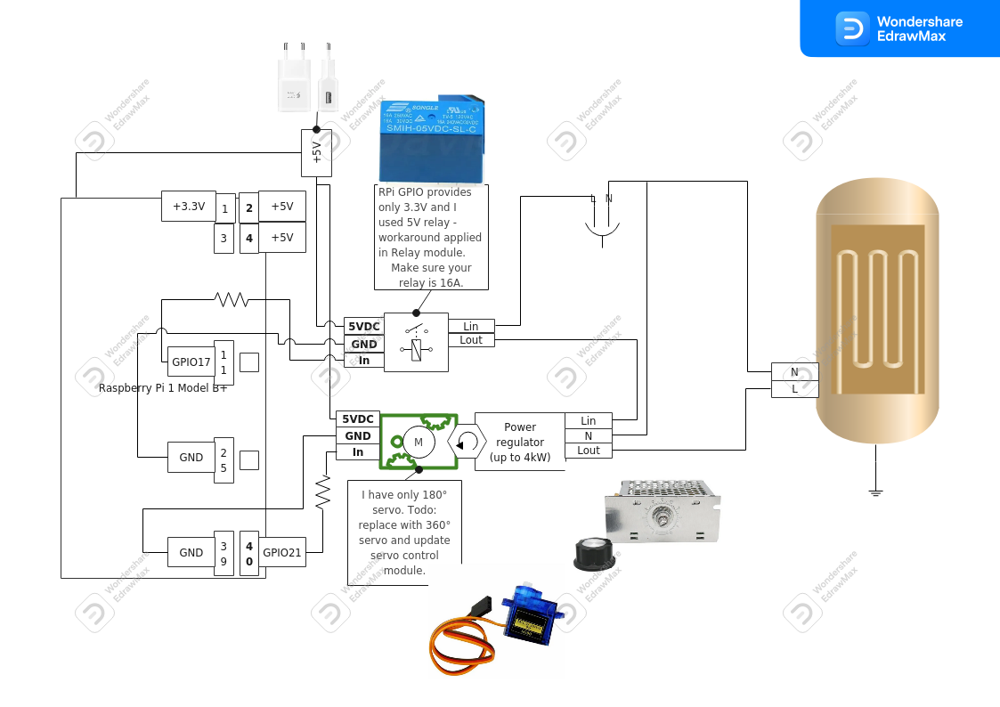
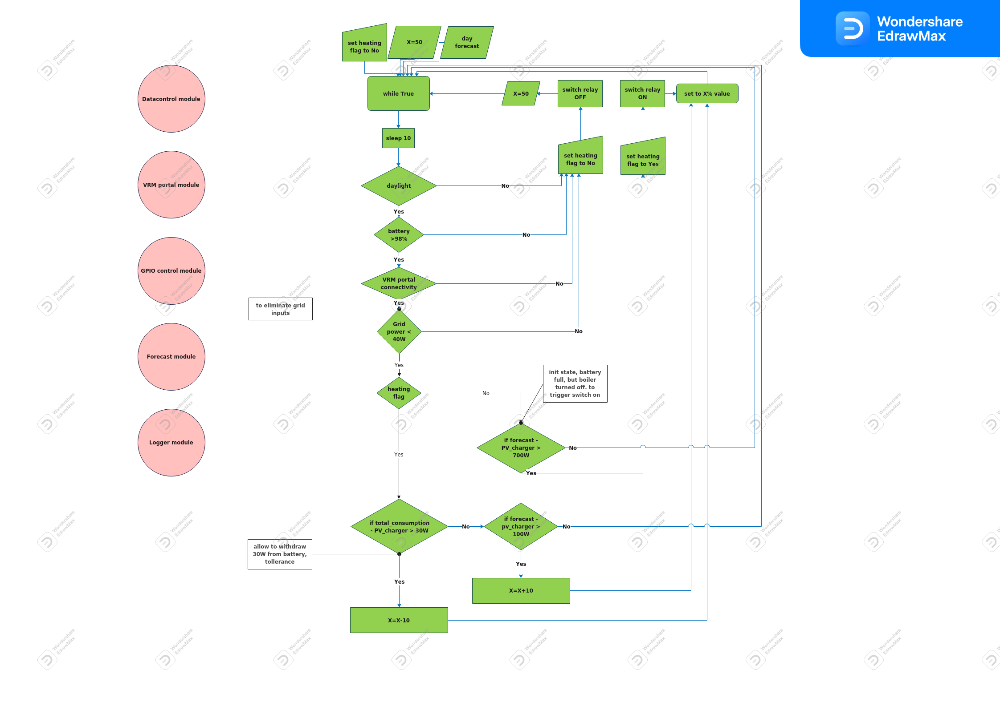

# PV HEATER OPTIMIZER

A lightweight replacement for Wattrouter device. Since wattrouter price is 300+ EUR, this setup can replace it within about 30 EUR.
I bought most of items on Aliexpress, wrote the code, assembled them together and run. Now I can utilize solar power for water heater when there is no "full sun power" on PV.
No need to buy a special PV/DC boiler you can use standard AC one.

## Ingredients

* Raspberry Pi, model B+ (or any other Pi which you can control PINs with) running Armbian OS
* 5V relay
  * Preferred is 3.3V relay as RPi GPIO OUT pins provide 3.3V.
  * I had only 5V handy, thus needed to write a workaround to handle HIGH/LOW relay states.
  * Bought [HERE](https://www.aliexpress.com/item/1005004573642720.html?spm=a2g0o.order_list.order_list_main.5.21ef1802DyCOxd).
* Servo motor
  * Preferred is 360°, but I had only 180° handy so used that one.
  * When the servo motor is replaced a servocontrol module needs to be altered.
  * Bought [HERE](https://www.aliexpress.com/item/4000604324530.html?spm=a2g0o.order_list.order_list_main.27.21ef1802DyCOxd)
* Power regulator
  * I'm using 4000Watts.
  * Bought [HERE](https://www.aliexpress.com/item/4001121524703.html?spm=a2g0o.order_list.order_list_main.42.21ef1802DyCOxd)
* Water heater, boiler
  * A home water-heating appliance
* Victron PV system, my setup is:
  * PV panels: 2.5kWp
  * Solar Charger: BlueSolar Charger MPPT 150/45 rev3
  * VE.BUS system: Victron MultiPlus 48V, 3000V, 50A
  * Pylontech battery: 2x2.4kWh
  * Gateway: VenusGX
  * Grid Meter: Energy Meter ET340

## Physical Setup

[](Pics/SCHEMATIC.png)

## Configuration File

Configuration file is stored on path `Files/config.yaml`, or you can provide your own configuration file using cli arguments.
Each value is described, if anything is not clear, feel free to reach out to me directly at .

## Usage

```bash
git clone git@github.com:matuspetrik/pv_heater_optimizer.git
cd pv_heater_optimizer
. env.sh
```

Update the configuration file on path `Files/config.yaml` and run

```bash
python main.py
```

Or use the config file defined by your own

```bash
python main.py --config Files/config-private.yaml
```

## Process Flowchart

[](Pics/flowchart.png)

## Basic Workflow Description

With initial values provided in configuration file, the script tracks current status on Victron portal.

Based on conditions like:

* Daylight time
* Battery status
* VRM portal connectivity
* Grid power consumption
* Power forecast for the given area

It sets the relay ON or OFF when forecasted power is <fcast_diff> more than PV charger power value, meaning, no power is drawn by the home appliances.
When the relay is set to ON and conditions are met, based on these conditions it increases or decreases servo motor so that more/less power is traversed through power regulator to the water heater.
If all the conditions are settled and forecast vs. PV charger power values are in tolerated level it just keeps the servo on current position.

All significant events are logged to log file provided in config file.

## Safety Measurements

> :warning: Working with high-power electricity, make sure you always delegate the work to the authorized person!

## Enhacements

* replace physical potentiometer with digital one
* use databases to store some accessed values
* use localy provided values instead of Victron portal ones
* make the python script a system service running at RPi startup (currently running via `screen`)
* explain to users `ngrok` or other vpn type to connect to RPi behind NAT
